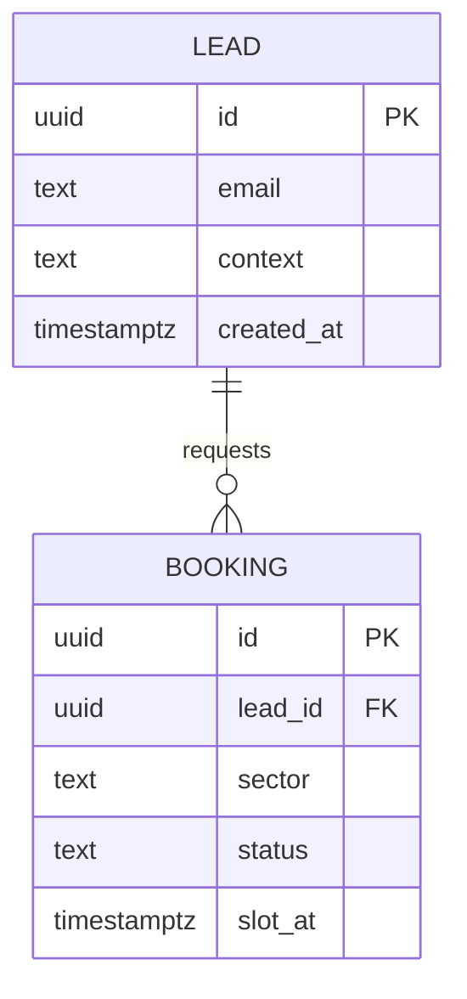
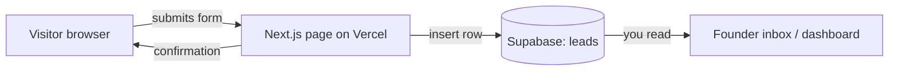
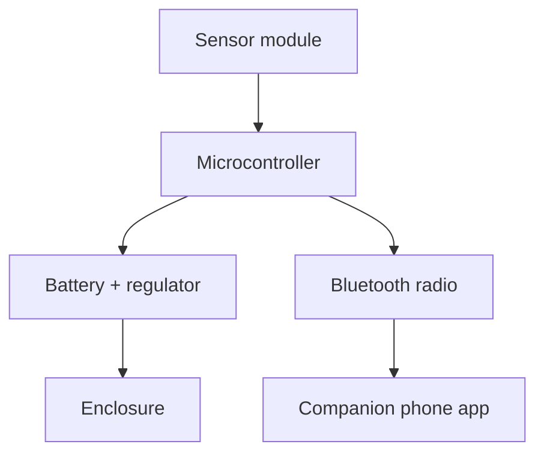
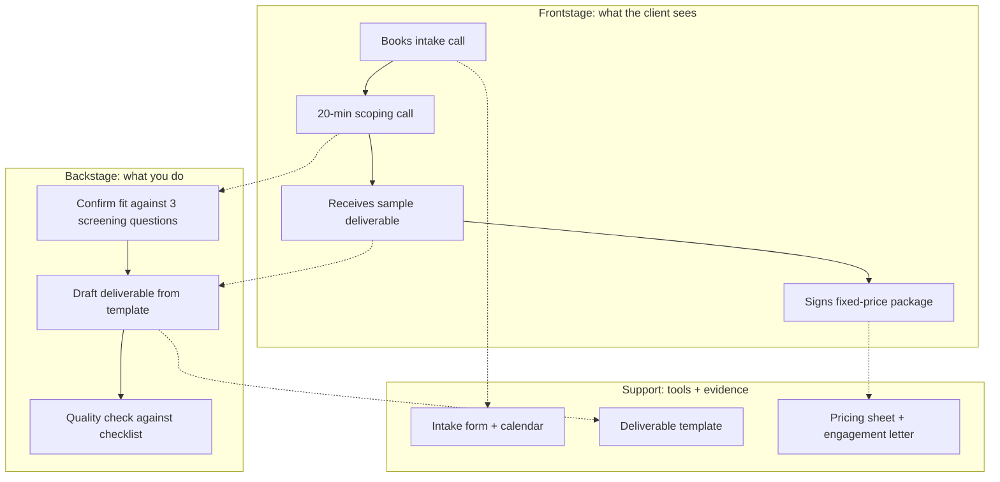

# Blueprint templates (Mermaid)

Copy the block for your path into `03-product/docs/blueprint.md`, then replace every
placeholder with the real thing from your PRD. Keep the diagram type keyword on the first
line inside the fence (erDiagram, flowchart, sequenceDiagram). The checker looks for it.

Mermaid renders on GitHub, in most Markdown previewers, and in Claude Code. If a diagram
will not render, it is almost always a stray bracket or a label with an unescaped colon.
Put labels with punctuation in double quotes.

---

## Software: data model (ERD) plus system diagram

You need two diagrams. The ERD says what you store. The system diagram says how a request
flows from the visitor's browser to the database and back.

### Data model

Keep it to the tables the Day 3 slice actually reads or writes. One or two tables is normal
for a first slice. If you have drawn more than four, you are building next week's product.

### System diagram

What good looks like: every box is a real thing that exists by Friday. No box labelled
"AI engine" or "future integration". If it is not in the PRD, it is not on the diagram.

---

## Hardware: system diagram plus bill of materials

You need a system diagram of the physical product and a costed bill of materials (BOM).
The BOM is what turns "a nice idea" into a unit cost you can price against.

### System diagram

### Bill of materials

A Markdown table. Every row is a real part with a real supplier price. Flag anything you
have not sourced yet as an assumption, never invent a number.

| Ref | Part | Supplier | Qty | Unit cost (GBP) | Line cost (GBP) | Notes |
|-----|------|----------|-----|-----------------|-----------------|-------|
| C1 | Microcontroller (ESP32) | Mouser | 1 | 4.20 | 4.20 | quoted |
| C2 | Temp/humidity sensor | Mouser | 1 | 2.80 | 2.80 | quoted |
| C3 | LiPo cell 1200mAh | RS | 1 | 3.50 | 3.50 | quoted |
| C4 | Enclosure (3D print) | in-house | 1 | 1.10 | 1.10 | assumption, material only |
| | | | | **Total** | **11.60** | excludes assembly labour |

The total is the number that anchors your pricing. Write it as a number, not "cheap".

---

## Services: service blueprint

A service blueprint shows the customer's journey across the top and everything you do behind
the scenes to make it happen underneath. Model it as a flowchart with lanes (subgraphs): what
the customer sees (frontstage), what you do out of sight (backstage), and the tools or systems
that support it.

What good looks like: every frontstage step the client experiences has at least one backstage
action that delivers it. A frontstage step with nothing behind it is a promise you cannot keep.
A backstage action with no frontstage step is work the client never asked for. Both are waste.

If a flowchart with lanes feels forced, a `sequenceDiagram` between "Client", "You" and "System"
also passes the checker and reads well for a step-by-step handover.
